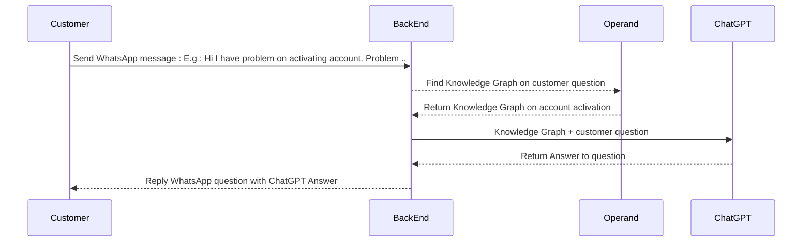

# chatgpt-whatsapp-AI-Chatbot
Whatsapp AI Chatbot ChatGPT - Automatic generate responses to customer inquiry based on domain knowledge

* WhatsApp Chat Bot based on publicly available Website and Knowledge base.
* Using OpenApi ChatGPT  
* Responsive
* Answer according to context


# Dependency  

* OpenApi chatgpt : Interact with OpenAi ChatGPT
* whatsapp-web.js : WhatsApp Integration 
* operandinc/sdk :  Build Index from web and generate knowledge graph


# Setup Installation 

* Prepare Index and knowledge graph  at https://operand.ai 

* Edit .ENV file
  * Create OpenAI Key and set into  OPENAI_API_KEY
  * Setup Operand  OPERAND_KEY and OPERAND_INDEX_KEY

* setup WhatsApp API client and  connects through the WhatsApp

* Install dependency 
```
npm install
```

# Run ChatGPT AI Chatbot

```
npm run start
```

test the chat functionality by send Whatsapp message to registered number :

example : 
|ChatGPT AI Chatbot             | Customer                    |
|-------------------------------|-----------------------------|
|                               |`!cimb Hi I have problem on activating account. Problem related .. `       |
|`Reply from ChatGPT AI Chatbot .... `            |      |


# Sequence Diagram of ChatGPT AI Chatbot


